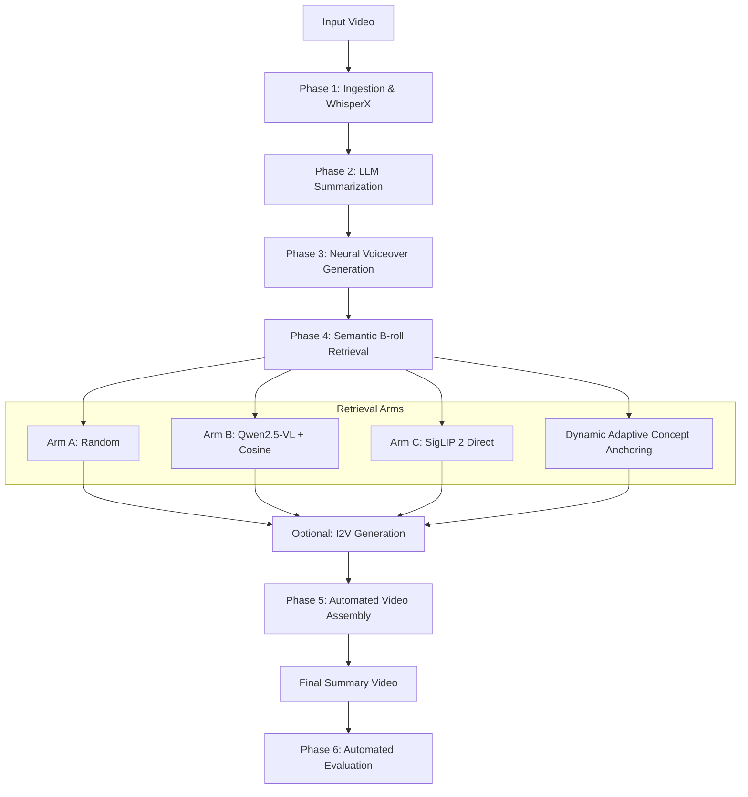

# 🎬 Video Summarizer AI: Multi-modal Pipeline for Automated Podcast Highlights

[](https://www.python.org/downloads/release/python-3110/)
[](https://fastapi.tiangolo.com/)
[](https://reactjs.org/)
[](https://developer.nvidia.com/cuda-toolkit)
[](https://opensource.org/licenses/MIT)

An advanced, production-grade AI pipeline designed to transform long-form video podcasts into short, engaging highlight reels. This project integrates state-of-the-art multi-modal models for transcription, semantic analysis, neural voiceover, intelligent B-roll retrieval, and Image-to-Video (I2V) generation, culminating in a fully automated video assembly process.

---

## 🚀 Key Innovations (Main Branch)

This repository holds the final codebase for the thesis project, featuring rigorous academic baselines, predictive anchoring, and scaled evaluation:

*   **⚓ Predictive DACA (Dynamic Adaptive Concept Anchoring)**: Implemented offline validation and predictive weighting mechanisms for SDXL to maintain visual consistency across generated B-roll shots without manual tuning.
*   **📚 Consistency Framework Baselines**: Integrated and evaluated external consistency frameworks like `ConsiStory` and `StoryDiffusion` as strong baselines to compare against our custom retrieval arms on a multi-dimensional fair-plane.
*   **🎥 Image-to-Video (I2V) Integration**: Supports transforming generated B-roll images into dynamic video clips using models like **Wan I2V**, pushing the final summary video to a fully animated state.
*   **⚖️ N=10 Scaled Evaluation & VLM Judge**: Scaled the end-to-end pipeline to process 10 full videos, incorporating an automated Vision-Language Model (VLM) as a judge to evaluate factualness, temporal coherence, and visual alignment.
*   **🔍 Alt-1 Predictive Selection (VAE)**: Conducted forensic audits and validation of the structural selection mechanism using VAE-decode for optimized scene placement.
*   **📈 Thesis Artifact Generation**: Comprehensive automated scripts to generate contact sheets, scatter plots, and aggregated CSV metrics for final thesis reporting.

---

## 🌟 Key Features

*   **🎙️ Precision Transcription**: Powered by **WhisperX** (large-v3) for word-level timestamps and robust audio alignment.
*   **🧠 Intelligent Scripting**: Utilizes **Llama 3.3 (via Groq)** or local **Qwen2.5-14B** to identify semantic highlights and generate concise summary scripts.
*   **🗣️ Neural Voiceover**: High-fidelity speech synthesis using **Kokoro v1.0** (ONNX) for natural-sounding narration.
*   **🔍 Semantic Visual Retrieval (3-Arm Strategy)**: 
    - **Arm A (Random)**: Baseline for evaluation.
    - **Arm B (Caption-Cosine)**: Cross-modal matching using **Qwen2.5-VL** captions and Sentence-Transformers.
    - **Arm C (SigLIP 2 Direct)**: Zero-shot vision-language retrieval using Google's **SigLIP 2**.
*   **🎬 Automated Video Assembly**: Precise frame-level muxing with **FFmpeg**, featuring silence padding (200ms), I2V workflows, re-encoding (H.264 CRF 20), and burned-in subtitles.
*   **📊 Evaluation Framework**: Automated metrics including **ROUGE-L**, **BERTScore**, and **CLIPScore** (plus DINOv2 content preservation), complemented by an **LLM-as-Judge** scoring system.
*   **💻 Modern Web Interface**: A sleek React-based dashboard with real-time WebSocket progress tracking and comparative evaluation metrics.

---

## 🏗️ System Architecture



---

## 🧪 The 3-Arm Retrieval Strategy

A core component of this project is the comparative analysis of visual retrieval methods:

| Arm | Method | Tech Stack | Characteristics |
| :--- | :--- | :--- | :--- |
| **Arm A** | Random | `numpy.random` | Baseline control. |
| **Arm B** | Caption-Cosine | `Qwen2.5-VL-7B` + `Sentence-Transformers` | Semantic bridge via natural language descriptions. |
| **Arm C** | SigLIP 2 Direct | `google/siglip2-so400m` | Direct vision-language embedding alignment. |

---

## 🛠️ Tech Stack

### Backend
- **Core**: Python 3.11, FastAPI, Pydantic
- **ML/AI**: Torch 2.5.1, Transformers, WhisperX, Open-CLIP, SigLIP 2
- **Image & Video Gen**: SDXL (with DACA), ConsiStory, StoryDiffusion, Wan I2V
- **Video/Audio**: FFmpeg (via `ffmpeg-python`), `pyscenedetect`, `librosa`
- **Evaluation**: `rouge-score`, `bert-score`, `clip-score`, DINOv2

### Frontend
- **Framework**: React 18, Vite
- **Styling**: Tailwind CSS
- **Communication**: WebSockets (Real-time progress), REST API

---

## 📊 Evaluation & Metrics

The pipeline includes a robust evaluation suite to measure the quality of generated summaries across multiple dimensions:

1.  **Information Quality**: ROUGE-L and BERTScore against original transcript.
2.  **Visual Alignment**: CLIPScore between summary script and retrieved B-roll.
3.  **Concept & Content Consistency**: Evaluated using CLIP-T for concept alignment and DINOv2 for content preservation across shots.
4.  **Human-like Judgment**: LLM-as-Judge (using Llama 3.3 70B / Qwen2.5) scoring Information, Factualness, and Visuals on a 1-5 scale.

---

## 🚀 Getting Started

### Prerequisites
- **OS**: Ubuntu 22.04 or WSL2
- **GPU**: NVIDIA RTX 3090/4090 (24GB VRAM recommended for local LLM & VL models)
- **Tools**: Python 3.11, FFmpeg (with `libx264` and `libass`)

### Installation

1. **Clone the Repository**
   ```bash
   git clone https://github.com/jbrandons13/SummarizerAI.git
   cd SummarizerAI
   ```

2. **Environment Setup**
   ```bash
   # Create conda environment or venv
   conda create -n sumarizer python=3.11
   conda activate sumarizer
   pip install --upgrade pip
   pip install .
   # Note: transformers must be installed from source for SigLIP 2 support
   pip install git+https://github.com/huggingface/transformers
   ```

3. **Configuration**
   Copy the example environment file and fill in your API keys (Groq, etc.):
   ```bash
   cp .env.example .env
   ```

### Running the Application

1. **Start the Backend Server**
   ```bash
   python scripts/run_server.py
   ```

2. **Start the Frontend Development Server**
   ```bash
   cd frontend
   npm install
   npm run dev
   ```

---

## 📁 Folder Structure

```text
video-summarizer/
├── src/                # Core logic (Phases 1-6)
│   ├── api/            # FastAPI routes and WebSocket handlers
│   ├── eval/           # Metrics and LLM-as-Judge implementation
│   ├── models/         # Model wrappers (VRAM-safe loaders)
│   ├── utils/          # FFmpeg ops, VRAM management, IO helpers
│   └── pipeline.py     # Main orchestrator
├── frontend/           # React + Vite application
├── configs/            # YAML configuration for pipeline parameters
├── results/            # Ablation study results, plots, and stats
├── data/               # Persistent storage for raw/processed assets
├── tests/              # Comprehensive test suite
└── consistory/         # ConsiStory baseline implementation scripts
```

---

## 📝 License

Distributed under the MIT License. See `LICENSE` for more information.

---

*This project was developed as part of a thesis exploring multi-modal AI applications in automated content creation, including advanced retrieval and consistency frameworks.*
