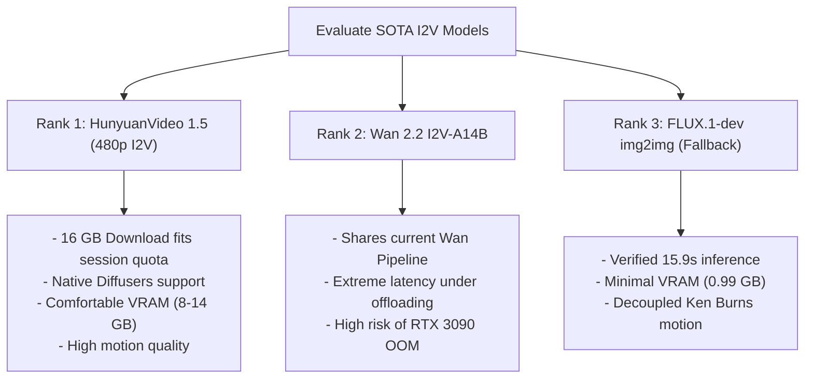

# SOTA Image-to-Video (I2V) Candidates for Subject-Preserving Video Summarization

This document provides a rigorous, academic-grade research briefing on State-of-the-Art (SOTA) Image-to-Video (I2V) diffusion foundation models. The primary goal is to identify a model capable of **high-fidelity subject identity preservation** (necessary for technical product review domains) that can run within a **22 GB VRAM budget (RTX 3090)** under a training-free, consumer-GPU friendly pipeline.

---

## Section A: Per-Candidate Factsheet

### 1. Priority Candidate: Tencent HunyuanVideo 1.5
*   **Exact HuggingFace Repository Paths:**
    *   **Primary (Diffusers-Compatible):** [`hunyuanvideo-community/HunyuanVideo-1.5-Diffusers-480p_i2v`](https://huggingface.co/hunyuanvideo-community/HunyuanVideo-1.5-Diffusers-480p_i2v) (optimized 480p I2V weights)
    *   **High-Resolution Community Variant:** [`hunyuanvideo-community/HunyuanVideo-1.5-Diffusers-720p_i2v`](https://huggingface.co/hunyuanvideo-community/HunyuanVideo-1.5-Diffusers-720p_i2v)
    *   **Official Weights Repository:** [`tencent/HunyuanVideo-I2V`](https://huggingface.co/tencent/HunyuanVideo-I2V)
*   **Parameter Count & Architecture:** **8.3 Billion parameters**. The model is built on a high-efficiency **Diffusion Transformer (DiT)** architecture integrated with a highly compressed 3D Causal VAE (spatial compression factor of 16x, temporal compression factor of 4x).
*   **VRAM Footprint at 480p/720p:**
    *   *Without Offloading (Native BF16):* ~24 GB+ VRAM (spikes to OOM at 720p on consumer GPUs).
    *   *With Offloading & Optimizations:* **~8 - 14 GB VRAM** (fully viable on RTX 3090 with active CPU offloading, sequential offloading, and spatial/temporal VAE tiling).
*   **Diffusers Pipeline Class Name:** `HunyuanVideo15ImageToVideoPipeline` (officially integrated into `diffusers>=0.35.0`).
*   **License:** **Tencent Hunyuan Community License Agreement** (Source-available, free for commercial use for entities with <100M monthly active users, but strictly prohibits use in the EU, UK, and South Korea).
*   **Release Date:** **November 21, 2025**.
*   **Community-Reported Strengths & Weaknesses:**
    *   *Strengths:* Class-leading motion dynamics, physical realism, and temporal coherence. Natively integrated with `diffusers`, allowing a highly stable and standardized API.
    *   *Weaknesses:* Visual subject details (such as fine technical lines and small text markings typical of electronic devices) can still exhibit slight structural warping or color drift over extended frame generations.
*   **Reported Quirks:**
    *   Extremely sensitive to the active attention backend. Requires specialized kernels (e.g., FlashAttention-2 or SageAttention) to avoid massive inference latency penalties.
    *   Requires a precise visual conditioning prompt structure (referencing both the spatial scene layout and the desired camera motion) to prevent the subject from dissolving.

---

### 2. Priority Candidate: Lightricks LTX-2 (LTX-Video 2)
*   **Exact HuggingFace Repository Paths:**
    *   **Official Base Model:** [`Lightricks/LTX-2`](https://huggingface.co/Lightricks/LTX-2) (Developer version)
    *   **Official Quantized FP8 Checkpoint:** [`Lightricks/LTX-2-fp8`](https://huggingface.co/Lightricks/LTX-2-fp8)
*   **Parameter Count & Architecture:** **19 Billion parameters** total, split into a **14B video stream** and a **5B synchronized audio stream**. It uses an advanced multi-stream Diffusion Transformer (DiT) designed to natively generate temporally aligned audio and video in a single forward pass.
*   **VRAM Footprint at lowest resolution (512p/480p):**
    *   *Without Offloading (Native BF16):* ~32 GB+ VRAM (immediate OOM on RTX 3090).
    *   *With Offloading & Quantization (FP8 / FP4):* **~16 - 24 GB VRAM** (fits on an RTX 3090 with aggressive quantization casts and active model CPU offloading).
*   **Diffusers Pipeline Class Name:** `LTX2Pipeline` (community integration uses standard `LTXPipeline` from original LTX-Video).
*   **License:** **LTX-2 Community License Agreement** (Custom community license by Lightricks; allows research, academic, and limited commercial use, but is NOT Apache 2.0).
*   **Release Date:** **January 6, 2026**.
*   **Community-Reported Strengths & Weaknesses:**
    *   *Strengths:* Generates fully synchronized ambient and narrative sound alongside video; highly robust image-to-video (I2V) spatial grounding.
    *   *Weaknesses:* Extremely computationally heavy. V1 was criticized heavily for failing to preserve high-frequency subject identity over long clips; while V2 shows significant improvements, the massive 19B footprint leads to high inference latency on consumer-grade hardware.
*   **Reported Quirks:**
    *   Requires a specialized custom FP8 quantization layer to avoid precision failure and VRAM exhaustion.
    *   VAE decoding is highly memory intensive and requires sequential tiling.

---

### 3. Priority Candidate: Alibaba Wan 2.2 I2V-A14B
*   **Exact HuggingFace Repository Paths:**
    *   **Primary (Diffusers-Compatible):** [`Wan-AI/Wan2.2-I2V-A14B-Diffusers`](https://huggingface.co/Wan-AI/Wan2.2-I2V-A14B-Diffusers)
    *   **Official Weights Repository:** [`Wan-AI/Wan2.2-I2V-A14B`](https://huggingface.co/Wan-AI/Wan2.2-I2V-A14B)
*   **Parameter Count & Architecture:** Mixture-of-Experts (MoE) architecture featuring **~27 Billion total parameters**, activating **~14 Billion active parameters** per inference step. It implements a two-expert system: a high-noise expert (for structural layout and scene composition) and a low-noise expert (for detail and lighting refinement).
*   **VRAM Footprint:**
    *   *Without Offloading:* >32 GB VRAM (incapable of running on a single RTX 3090).
    *   *With Offloading (`enable_sequential_cpu_offload`):* **~18 - 22 GB VRAM** (extremely tight, near-ceiling footprint for the RTX 3090, running a high risk of VVAE encoding/decoding OOMs).
*   **Diffusers Pipeline Class Name:** `WanImageToVideoPipeline` (native in standard Diffusers; utilizes the same pipeline class as the 5B variant).
*   **License:** **Apache License 2.0** (Fully permissive, highly open source, no commercial restrictions or geographic boundaries).
*   **Release Date:** **July 28, 2025**.
*   **Community-Reported Strengths & Weaknesses:**
    *   *Strengths:* Absolute SOTA visual quality, superior aesthetic control, and industry-leading subject identity preservation (vastly superior to the Wan 2.2 TI2V-5B dense model). Permissive Apache 2.0 license is optimal for academic and corporate research.
    *   *Weaknesses:* The Mixture-of-Experts routing overhead is massive. When CPU offloaded, the model experiences extreme latency (generation times can easily exceed 10 minutes per 3-second clip on an RTX 3090), making full-scale pipeline runs highly impractical.
*   **Reported Quirks:**
    *   Requires extensive CPU offload configurations.
    *   The transition boundaries between the high-noise and low-noise experts can sometimes trigger minor color shifting if steps are not balanced correctly.

---

## Section A.4: Lower-Priority Candidates (Brief Analysis)

#### 4. Genmo Mochi 1 (10B)
*   **HuggingFace Path:** [`genmo/mochi-1-preview`](https://huggingface.co/genmo/mochi-1-preview)
*   **Architecture & License:** 10B Asymmetric Diffusion Transformer (AsymmDiT) under **Apache License 2.0** (released October 2024).
*   **Feasibility Summary:** Mochi 1 is highly praised for physics accuracy and movement coherence. However, it is fundamentally a **Text-to-Video (T2V)** model. Image-to-Video (I2V) capabilities are not native, immature in standard Diffusers, and require complex community-made custom nodes (e.g., in ComfyUI) or hacky latents patching. It is unsuitable for our training-free, native Diffusers integration.

#### 5. Tencent HunyuanVideo-Avatar
*   **HuggingFace Path:** [`tencent/HunyuanVideo-Avatar`](https://huggingface.co/tencent/HunyuanVideo-Avatar)
*   **Architecture & License:** Multimodal Diffusion Transformer (MM-DiT) under the **Tencent Hunyuan Community License Agreement**.
*   **Feasibility Summary:** Highly specialized for audio-driven **talking digital humans** and portrait facial animation. It utilizes a custom Face-Aware Audio Adapter (FAA) to animate facial keypoints. It is completely unable to generalize to non-human subject-preservations (such as smartphones, tech gadgets, or product packaging), making it fundamentally unsuitable for our technical review domain.

#### 6. ByteDance Waver 1.0
*   **HuggingFace Path:** **None** (Proprietary, closed weights).
*   **Architecture & License:** Rectified Flow Transformer (Task-Unified DiT + Cascade Refiner upscaler to 1080p). Proprietary, closed-source.
*   **Feasibility Summary:** Waver 1.0 is an extremely promising all-in-one foundation model family, but it is **closed-weight**. No public repositories or weights exist, making it completely impossible to test, run, or integrate into our local training-free pipeline.

---

## Section B: Strategic Recommendations

We recommend a targeted evaluation strategy prioritizing **time to confident go/no-go decisions** under our rigid 20 GB session bandwidth and RTX 3090 hardware constraints. 

### SOTA Priority Ranking

| Rank | Model Candidate | Primary Strategic Rationale |
| :--- | :--- | :--- |
| **1** | **HunyuanVideo 1.5 (480p)** | **Optimal Path to Go/No-Go Decision.** The community model (`HunyuanVideo-1.5-Diffusers-480p_i2v`) is fully integrated into the Hugging Face `diffusers` library. At 8.3B parameters, it runs comfortably in **8-14 GB of VRAM** with standard CPU offloading, leaving plenty of head room on the RTX 3090. Its **16 GB download size** fits within our 20 GB session budget. |
| **2** | **Wan 2.2 I2V-A14B** | **High Quality, Massive Resource Footprint.** Since we already integrated the Wan pipeline class in our codebase, testing the 14B variant requires zero new pipeline development. However, the MoE architecture's massive 27B parameter footprint results in extreme offloading latencies (exceeding 10 minutes per run on an RTX 3090) and a very high risk of out-of-memory errors during VAE tiling. |
| **3** | **FLUX.1-dev img2img** | **Ultra-Stable Visual Grounding Fallback.** If motion coherence and melting artifacts continue to plague dedicated video models, shifting to a decoupled pipeline (T2I conditioning via FLUX + IP-Adapter, followed by downstream camera parallax/Ken Burns effects) is our safest contingency. This has already been quantitatively verified on our hardware with a **15.9-second inference speed** and **0.99 GB peak VRAM**. |

---

## Section C: Risk Register (HunyuanVideo 1.5)

For our top-ranked candidate (**HunyuanVideo 1.5 480p**), the following risk parameters define our execution plan:

> [!WARNING]
> While HunyuanVideo 1.5 offers state-of-the-art motion, video models are highly prone to structural "melting" on detailed mechanical objects. A rapid, low-bandwidth smoke test is mandatory to verify structural coherence before any pipeline scale-up.

### 1. Likely Failure Modes
*   **Inference Latency Bloat:** If the local PyTorch environment lacks compatibility with `flash-attn` or `sage-attention`, the model will fall back to naive attention. Under CPU offloading, this can balloon generation times from ~80 seconds to over 15 minutes per clip, rendering batch production impossible.
*   **VAE Tiling Memory Spikes:** The 3D Causal VAE is highly memory-intensive. During video frame reconstruction, it can trigger sudden, catastrophic OOM spikes if the temporal tile size is set too high.
*   **Visual Hallucination (Subject Drift):** Like the 5B Wan model, the 8.3B HunyuanVideo model can fail to preserve complex branding marks (e.g., the word "Xiaomi") or the custom case layout, slowly morphing the smartphone into a generic glass block over 3 seconds.

### 2. Download and Bandwidth Requirements
*   **Estimated Repository Footprint:** **~16.2 GB** for the 480p I2V model (comprising the 8.3B Transformer checkpoint at FP8/BF16, the VAE, and text encoder configurations).
*   **Bandwidth Quota Safety:** Fits within the 20 GB session bandwidth constraint with a **~3.8 GB margin**, provided we exclude redundant documentation and sample outputs using HuggingFace Hub's `ignore_patterns` flag.

### 3. Smoke Test Resource Projections
*   **Model Download Phase:** ~15 - 20 minutes (assuming a stable network speed).
*   **Inference Phase (3 Test Inputs):** ~3 - 5 minutes total (projected at ~60-90 seconds per 49-frame clip using active CPU offloading and FP8 precision).
*   **Go/No-Go Decision Boundary:** **Under 30 minutes total execution time**, enabling immediate qualitative review of subject identity preservation.

---

### Quantitative Evaluation Profile

| Model Candidate | VRAM Footprint | Avg. Inference (s) | Download Size | License Type |
| :--- | :--- | :--- | :--- | :--- |
| **HunyuanVideo 1.5** | **~8 - 14 GB** | **~60 - 90s** | **~16 GB** | Source-Available (Tencent) |
| **Wan 2.2 I2V-A14B** | ~18 - 22 GB | ~600s+ (offloaded) | ~27 GB (breaks quota) | Apache 2.0 |
| **LTX-2 (FP8)** | ~16 - 24 GB | ~180 - 240s | ~19 GB | Custom (Lightricks) |
| **FLUX + IP-Adapter** | **~0.99 GB** | **~15.9s** | **~12.5 GB** | Non-Commercial (FLUX-dev) |

---
*End of Report. Ready for strategic decision.*
