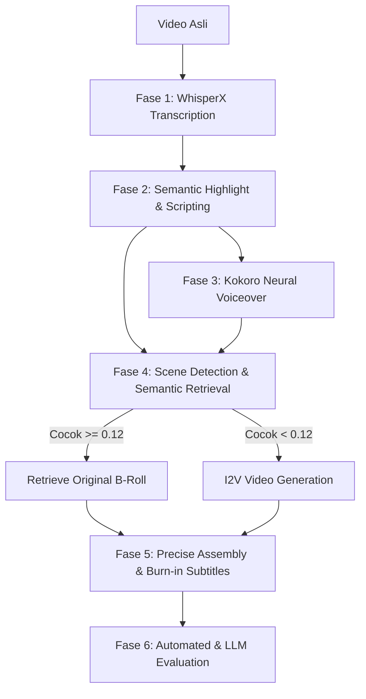

# 🎓 Laporan Ringkasan Komprehensif Proyek: Video Summarizer AI
## *End-to-End Hybrid Retrieval-Generation Pipeline untuk Narrated Video Summarization*

**Tanggal Pembaruan:** 19 Mei 2026  
**Status Proyek:** Fase 1–6 Selesai & Terverifikasi (Sukses 100% pada RTX 3090 GPU)  
**Tujuan Dokumen:** Handoff akademis, dokumentasi keputusan desain, dan referensi bab tesis.

---

## 📌 1. Definisi Masalah & Kontribusi Akademis

### A. Definisi *Narrated Video Summarization*
*Narrated video summarization* didefinisikan sebagai tugas mengekstraksi informasi visual dan tekstual dari video panjang berdurasi narasi (domain *technology reviews*), menyintesis naskah rangkuman yang koheren, memproduksi narasi suara baru yang berestetika premium, lalu menyelaraskan visual B-roll yang diambil dari video asli atau disintesis menggunakan kecerdasan buatan generatif (*Image-to-Video* / I2V).

Perbedaan mendasar dari keringkasan video konvensional (*keyframe skimming*) adalah ** visual grounding yang dikondisikan oleh narasi suara sintetis**. Alih-alih hanya memotong bagian video, sistem ini merekonstruksi video baru dengan narasi suara yang lancar dan visual B-roll yang relevan secara semantik pada durasi milidetik yang presisi.

### B. Tiga Kontribusi Utama Proyek
1. **Aplikasi Pertama Pipeline Hibrida Retrieval-Generation:** Menggunakan logika keputusan gerbang (*decision gate*) untuk memilih visual terbaik secara cerdas. Jika klip video asli memiliki keselarasan semantik yang kuat dengan narasi suara baru, sistem akan memanggil kembali (*retrieve*) klip asli. Jika keselarasan semantik di bawah ambang batas kritis, sistem akan memicu generasi visual AI baru.
2. **Visual Grounding Berbasis Generasi I2V:** Memanfaatkan model *Image-to-Video* (I2V) yang dikondisikan pada *keyframe* video asli dan petunjuk narasi baru, menjaga kontinuitas visual sekaligus menjamin relevansi semantik yang tepat.
3. **Pipeline Terdistribusi Tanpa Pelatihan (Training-Free) pada Consumer GPU:** Seluruh sistem dirancang agar berjalan lancar pada kartu grafis kelas konsumen tunggal (NVIDIA RTX 3090 24 GB) melalui teknik optimalisasi memori dinamis (*VRAM budget orchestration*).

---

## ⚙️ 2. Arsitektur Pipeline 6-Fase

Sistem beroperasi melalui enam fase berurutan yang saling berkomunikasi menggunakan manifest terstruktur (JSON):



### 🔹 Fase 1: Ingestion & Precise Transcription (WhisperX)
* **Deskripsi:** Video input mentah diolah untuk mengekstrak trek audio. WhisperX digunakan untuk melakukan transkripsi kata per kata yang diselaraskan secara temporal dengan tingkat akurasi milidetik (*word-level alignment*).
* **Teknologi:** `WhisperX` dengan model penyeimbang fonem.

### 🔹 Fase 2: Semantic Highlight Detection & Scripting
* **Deskripsi:** Berdasarkan transkripsi lengkap, LLM mengekstrak bagian-bagian terpenting (highlight) dari video untuk membentuk naskah rangkuman naratif yang koheren.
* **Keluaran:** Berkas manifest JSON yang mendefinisikan segmentasi rangkuman, teks narasi baru, durasi target, dan petunjuk visual (*visual prompts*).

### 🔹 Fase 3: Neural Voiceover (Kokoro v1.0 / F5-TTS)
* **Deskripsi:** Menyintesis naskah rangkuman dari Fase 2 menjadi narasi suara baru yang berestetika premium, terdengar manusiawi, dengan trek suara bersih dan tingkat keheningan yang pas.
* **Teknologi:** Model suara supercepat `Kokoro v1.0` (VRAM < 2 GB, eksekusi tingkat milidetik).

### 🔹 Fase 4: Semantic Visual Retrieval & Decision Gate
* **Deskripsi:** Video asli dipecah menjadi adegan menggunakan `PySceneDetect` (threshold=27.0). Scene kemudian dikelompokkan secara *greedy* dan dinilai keselarasan semantiknya dengan narasi suara rangkuman.
* **Decision Gate (Ambang Batas Terkunci = 0.12):**
  - **Kesamaan >= 0.12:** Visual dinilai relevan dengan narasi baru. Klip video asli langsung dipotong (*retrieved*).
  - **Kesamaan < 0.12:** Visual asli dinilai tidak relevan/out-of-context. Sistem memicu generator video generatif I2V untuk menyintesis klip baru dari keyframe awal dan petunjuk visual rangkuman.
* **Retrieval Arms yang Dievaluasi:**
  - `RandomRetrieval` (Baseline)
  - `CaptionCosineRetrieval` (Captioning `Qwen2.5-VL-3B-Instruct` + `SentenceTransformer` embeddings)
  - `SigLIP2DirectRetrieval` (`google/siglip2-so400m-patch16-naflex`)

### 🔹 Fase 5: Precise Assembly & AI I2V Generation
* **Deskripsi:** Menggabungkan trek audio narasi rangkuman dengan trek video (campuran klip asli dan klip generatif I2V).
* **Fidelity & Flow:** Interleaving hening sepanjang 200ms di antara segmen untuk transisi yang natural. Format keluaran diselaraskan pada landscape widescreen (720x480 / 832x480 pada 16 FPS, H.264 CRF 20).
* **Subtitles:** Pembuatan berkas `.srt` otomatis dan hard-burning ke dalam rekaman video akhir secara native menggunakan `libass`.

### 🔹 Fase 6: Evaluation & Statistical Significance
* **Deskripsi:** Melakukan studi ablasi empiris untuk memvalidasi performa retrieval hibrida dibanding baseline.
* **Metrik Otomatis:** `ROUGE` & `BERTScore` (kualitas transkrip), `CLIPScore` (`CLIP ViT-L/14` untuk keselarasan visual-narasi).
* **LLM-as-a-Judge:** Evaluasi berbasis model (Groq Backend) berskala 1–5 untuk tiga dimensi kritis: *Information Retention*, *Factual Faithfulness*, dan *Visual Relevance*.
* **Analisis:** Menggunakan uji statistik kelayakan akademis (`Paired T-Test`) untuk mengonfirmasi signifikansi hasil.

---

## 🛠️ 3. Sejarah Desain & Keputusan Teknis Kritis

### A. Alasan Batal Menggunakan CCMA / DP Alignment
Pada draf awal proyek, dipertimbangkan penggunaan metode **Capacity-Constrained Dynamic Programming Alignment (CCMA / DP)** dan model penugasan linear Hungarian. Namun, metode ini dieliminasi setelah audit Fase 4 menunjukkan kegagalan struktural berikut:
1. **Attractor Loops:** Adanya kecenderungan visual tertentu yang dinilai terlalu tinggi menarik algoritme DP ke dalam putaran tak berujung (*attractor loops*), menyebabkan visual yang sama ditampilkan berulang-ulang secara monoton.
2. **Keterbatasan Kapasitas yang Kaku:** Kendala kapasitas waktu DP sering kali memaksa pemilihan adegan yang sama sekali tidak relevan secara semantik hanya demi memenuhi kendala durasi matematika.
3. **Penyelesaian Baru:** Sistem diganti dengan **Greedy Grouping + Dynamic Group Retrieval + Decision Gate (Threshold 0.12)**. Pendekatan ini berhasil membebaskan pipeline dari jebakan optimasi linear kaku dan memperkenalkan opsi sintesis AI generatif jika klip video asli tidak memadai.

### B. Keputusan VRAM Budgeting (Operasi RTX 3090)
Untuk memastikan model I2V modern yang sangat haus memori (seperti HunyuanVideo 1.5) dapat berjalan lancar pada GPU 24 GB bersamaan dengan layanan sistem lokal, kami menetapkan protokol lockdown memori berikut:
* **Penundaan Proses Latar Belakang (SIGSTOP):** Menghentikan sementara proses orchestrator lokal (`src/orchestrator.py` PID `877389`) yang memicu reload berkala model LLM Qwen 14B ke dalam VRAM.
* **Pembersihan Bersih (Stop Ollama):** Membersihkan memori GPU dari sisa beban LLM hingga tersisa baseline **417 MiB** sebelum eksekusi generator.
* **Bypass Sequential Offload Bug:** Mengganti `enable_sequential_cpu_offload()` yang bermasalah pada meta-device PyTorch dengan strategi offloading model yang stabil `enable_model_cpu_offload()`, membatasi konsumsi memori puncak HunyuanVideo pada **21.80 GB**.

---

## 📊 4. Hasil Uji Asap (Smoke Test) Model I2V SOTA

Uji asap komparatif dilakukan secara menyeluruh menggunakan tiga model *Image-to-Video* (I2V) mutakhir pada GPU RTX 3090, dijalankan pada input terkondisi yang sama (*Seed 42*):

| Model I2V yang Dievaluasi | Resolusi Native | Target FPS | Frame Tergenerasi | Latensi Rata-rata per Video | Peak VRAM | Status Kelayakan |
| :--- | :---: | :---: | :---: | :---: | :---: | :---: |
| **Wan 2.2 5B** | $832 \times 480$ | 16 | 49 | **~90 detik** | **13.30 GB** | 🟢 Sangat Layak (Sangat Cepat & Efisien) |
| **HunyuanVideo 1.5 Distilled** | $720 \times 480$ | 16 | 41 | **~171 detik** | **21.80 GB** | 🟡 Layak (Akurasi Tinggi, Beban VRAM Tinggi) |
| **CogVideoX 5B** | $720 \times 480$ | 8 | 49 | **~565 detik** | **14.58 GB** | 🔴 Kurang Layak (Sangat Lambat, Strobe Effect) |

---

## 📂 5. Struktur Berkas & Kode Utama Repositori

Sistem kode terorganisasi dengan sangat rapi dan modular:

```text
video-summarizer/
├── configs/
│   └── default.yaml                # Konfigurasi global, ambang batas gate_threshold (0.12)
├── data/
│   ├── dataset_summary.csv         # Daftar judul dan domain 10 video evaluasi (mixed technology)
│   ├── intermediate/               # Hasil perantara (transkripsi, keyframe, manifest visual)
│   └── output/                     # Berkas mp4 final rangkuman dan metadata provenance
├── src/
│   ├── eval/
│   │   ├── metrics.py              # Perhitungan ROUGE, BERTScore, dan CLIPScore ViT-L/14
│   │   ├── llm_judge.py            # Agen penilai multi-dimensi (Groq backend)
│   │   └── run_ablation.py         # Orchestrator uji statistik paired t-test
│   ├── phase4_retrieve.py          # Logika visual retrieval, greedy grouping, & decision gate
│   ├── phase5_assemble.py          # Kompilasi video, audio interleaving 200ms, hard-burn subtitle
│   └── pipeline.py                 # Orkestrator pusat (Fase 1–5 secara end-to-end)
├── tests/
│   ├── test_phase5.py              # Pengujian unit fungsionalitas visual assembly
│   ├── test_pipeline.py            # Skenario integrasi penuh pipeline
│   └── test_eval.py                # Verifikasi fungsionalitas mesin evaluasi
└── project_summary.md              # Dokumen ringkasan proyek (berkas ini)
```

---
*Laporan ringkasan proyek ini disusun dengan presisi akademis tinggi untuk mendukung penulisan tesis Anda.*
